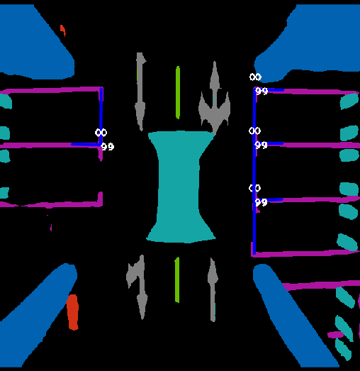

## SLAM 组代码
- 建图、地图后处理
- 基于已知地图的定位
- 实时障碍物检测
- 全局规划、局部规划


### 运行环境
系统：Ubuntu 20.04   & ROS noetic
平台：AGX & ORIN (ARM)、 PC (X86)

### 依赖库：
- pcl
- cere 1.14
- gtsam 4.0.0
- eigen3
- fmt
- glog
- g2o
- Sophus（模版类）
- 其他依赖
  ```
  sudo apt-get install -y ros-noetic-map-server
  sudo apt-get install -y ros-noetic-jsk-recognition
  sudo apt-get install -y ros-noetic-jsk-common-msgs
  sudo apt-get install -y ros-noetic-jsk-rviz-plugins
  sudo apt-get install -y ros-noetic-octomap*
  sudo apt-get install -y ros-noetic-joy
  sudo apt install -y coinor-libipopt-dev
  ```


### 编译（依次执行,初次有报错再编译）

```
cd ~/YOUR_WORK_SPACE_PATH
catkin_make -j8 -DCATKIN_WHITELIST_PACKAGES='customized_msgs, obstacle_msgs, ad_localization_msgs'
catkin_make -j8 -DCATKIN_WHITELIST_PACKAGES=''
```

### 运行

#### step 0 录制数据

- 在一个终端启动雷达
```
cd ~/YOUR_LIVOX_SPACE_PATH
source devel/setup.bash
roslaunch livox_ros_driver2 msg_MID360.launch
```
- 在xxx/livox_ws/src/livox_ros_driver2/config/MID360_config.json文件中，按实际雷达编号后两位，配置lidar_config的ip,如后两位为02，则"ip" : "192.168.1.112"

- 录制rostopic话题为bag,点云和imu数据
`
rosbag record /livox/lidar /livox/imu
`
- 操控机器人移动，结束后 'ctrl c' 保存bag

#### step 1 建图

- 在其中一个终端开启里程计节点
`
roslaunch sfast_lio mapping_mid360.launch
`
<p align="center">
  
  <br>
  <sub>图 1：AVP_SLAM </sub>
</p>


- 在另一个终端开启回环&地图保存节点
`
roslaunch livox_mapping livox_mapping.launch
`

- 然后在新终端中播放bag包
`
rosbag play xxx.bag
`

- bag包播完后，在livox_mapping终端中按's'并回车后开启保存流程，保存全部完成后在终端显示"finish saving process!!!"，此时再按ctrl+c退出程序。

- 最终，在 SC-PGO/PCD 中生成全局地图 scans_lc.pcd, 局部地图序列 pcds_ori, 位姿文件 lio_livox_slam.txt


#### step 2 地图后处理 （目前动态物体去除算法仍在调试，可以略过此步骤）

- 进入 PCD, 运行 `python3 set.py`, 在 PCD 里面可以得到处理好的 erasor 可用的文件： poses_lidar2body.csv points_ground.pcd pcds文件夹, 以及 points_top.pcd(储存全局地图中的 h>2 的部分).

- 在新终端中开启 erasor 节点
`
roslaunch erasor run_erasor_in_your_env_vel16.launch
`

- 在 SC-PGO/PCD 中 得到处理后的地图结果 bongewunsa_result.pcd.
- 运行 `python construct.py` 在 SC-PGO/PCD 中得到与 points_top.pcd 拼接后的全局地图 result.pcd.


#### step 3 转换为栅格地图

`
roslaunch map_conversion grid_2d_generation.launch
`
- 栅格地图默认会去 SC-PGO/PCD/pcds_ori 去获取局部点云以及SC-PGO/PCD/中获得局部地图对应的位姿lio_livox_slam.txt 生成栅格的默认路径是 Grid_Convert/data
- 修改 Grid_Convert/ningde_params.yaml 参数
  - global_max_z/global_min_z: 栅格地图由局部地图中距离地面高度global_min_z~global_max_z的所有点生成
  - lidar_height: 雷达安装位置距离地面的高度(lidar_height > 0)
  - outlier_removal_method: 表示对3D点云地图采用的杂点去除方式，0:不去除 1:统计滤波 2:半径滤波
  - outlier_removal函数中的点云滤波参数，注意对应选择的去除方法调整
    - mean_k: 邻域点数
    - mul_thresh: 标准差倍数阈值
    - search_radius: 半径搜索范围
    - min_neighbors: 邻域内最小点数


#### step 4 定位

- 运行定位工程，默认加载的地图位置为：SC-PGO/PCD 中生成的全局3D地图 scans_lc.pcd, 以及加载默认 Grid_Convert/data 中的 2D 栅格地图
`
roslaunch sfast_lio mid360_relocalization.launch
`

- 使用apriltag 评估定位精度，请运行以下工程  
`
roslaunch eva_april eva_april.launch
`

- 修改ICP初始化时匹配点云的直通滤波范围
- launch文件中的参数
  - map_filter_enable: 设为true则在配准前对点云地图的和首帧点云进行直通滤波，降低初始化耗时
  - map_filter_range: 设置x、y轴的直通滤波范围
  - 注意: map_filter_range过小会导致ICP初始化漂移，应足够大到能包含场景中足够多的大尺度轮廓信息

- 并且修改 EVA_APRIL/config.yaml 中的参数，包括：
  - tag板出现在视野范围内的时间记录(包括需要评估的不同点位的apriltag数量，开始和结束时间)
  - 相机与imu的外参设置
  - comera_intrinsics.yaml 中的相机内参（默认内参为三轮车的 OAK-D-PRO-W）

- 然后在新终端中播放bag包
`
rosbag play xxx.bag
`

- 注意：导航采用的定位Odometry话题名为/Odometry_robot，其为转换到机器人中心的定位位姿。障碍物坐标系变化以及栅格地图生成均采用的是IMU坐标系，即/Odometry话题。
- Update：发布机器人中心的高频（200Hz）定位位姿/HighFreqOdometry_robot。

#### step 5 定位&障碍物检测联合运行

- 运行定位&障碍物检测工程，默认加载的地图位置为：SC-PGO/PCD 中生成的全局3D地图 scans_lc.pcd, 加载默认 Grid_Convert/data 中的 2D 栅格地图，并可视化障碍物点云以及边缘点
`
roslaunch sfast_lio obj_detect_relocalization.launch
`

- 然后在新终端中播放bag包
`
rosbag play xxx.bag
`

- 参数设置参考step 4

#### step 6 单独运行障碍物检测

- 可视化障碍物点云以及边缘点
`
roslaunch objectcluster ObjSegVoxelGrid_lidar_grass.launch
`

- 然后在新终端中播放bag包
`
rosbag play xxx.bag
`

- 参数调整 objseg_voxelgrid.yaml
  - elevation_thr: 栅格绝对高度阈值，高度大于该阈值的障碍物栅格才会被视作候选障碍物栅格。
  - relative_diff_thr: 栅格相对高度阈值，高度与周围差值大于该阈值的障碍物栅格才会被视作候选障碍物栅格。
  - minGridCloudNum: 最小栅格点数，当栅格中至少包含minGridCloudNum点数时，才会被判断为障碍物栅格。注意，该值过小会导致杂点误检。

#### step 7 控制及导航功能

- 开启底盘通讯及控制
  - 运行SLAM/scripts/`control.py`脚本,接收rostopic消息，并向云迹底盘发送指令。
  - 若需手动操作，运行SLAM/scripts/`key_cmd.py`脚本，接收键盘指令，发送rostopic消息。
  - 若需查看底盘运动速度，运行SLAM/scripts/`feedback.py`脚本。

- 将机器人运动到建图的初始位置和方向: [0.0, 0.0, 0.0, 0.0, 0.0, 0.0, 0.0, 0.0, 0.0, 0.0, 0.0, 0.0, 0.0, 0.0
```
cd ~/YOUR_LIVOX_SPACE_PATH
source devel/setup.bash
roslaunch livox_ros_driver2 msg_MID360.launch
```

- 运行定位&障碍物检测工程
```
cd ~/YOUR_LIVOX_SPACE_PATH
source devel/setup.bash
roslaunch sfast_lio obj_detect_relocalization.launch
```

- 运行导航
```
cd ~/YOUR_WORK_SPACE_PATH  
source devel/setup.bash  
roslaunch local_planner start_static.launch
```

- 在RVIZ界面，选择终点和方向

- 修改参数文件路径:YOUR_WORK_SPACE_PATH/src/SLAM/planning/local_planner/config/planning.config
